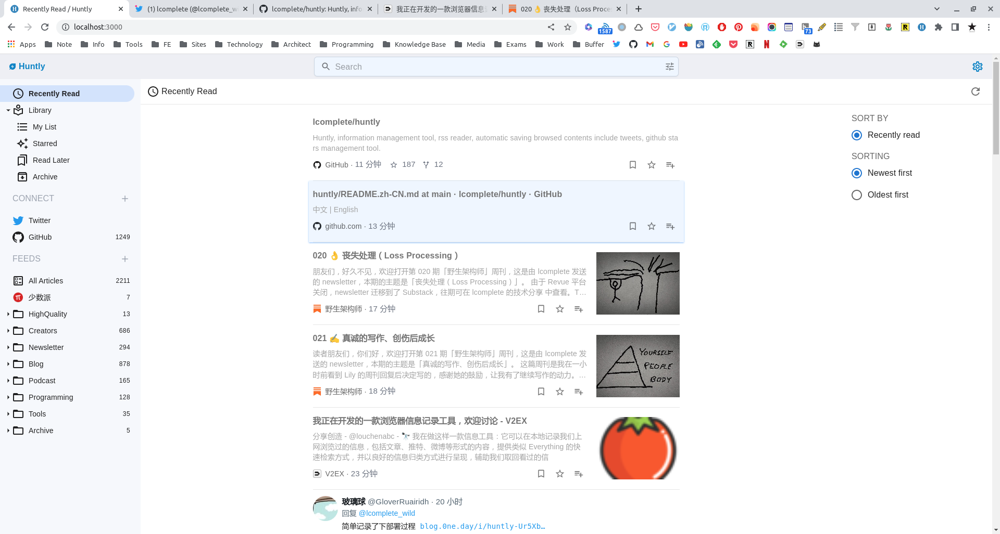

# Huntly

**中文** | [English](./README.en.md)

Huntly 是一个自托管的信息管理工具，简单来说，它包含以下功能：

- RSS 订阅和阅读。
- 自动保存浏览过的网页，随后以保存、稍后读、收藏或存档的方式将其保存。
- 针对推特网站有特殊的处理，会自动保存请求过的推特 timeline，记录是否浏览过，在 huntly 中你甚至可以用更方便的方式重新查看这些推文。
- 可以从标题、内容、类型、收藏方式等维度进行搜索。
- 连接其他服务，目前支持 GitHub，所以它也是一个 Github stars 管理工具。

未来可能会支持连接到 Pocket、Hypothesis 等服务。

# 示例站点

地址: [http://huntly.rom666.com:8000/](http://huntly.rom666.com:8000/)

用户名: demo

密码: huntlydemo

# 系统截图




# 运行前提

- Java 11

# 使用

## 运行服务端

可以使用 docker 或者 java 运行服务端。

### 使用 docker 运行

```sh
mkdir huntly && cd huntly
docker run -itd --name huntly --restart=always -p <host port>:80 -v `pwd`/data:/data lcomplete/huntly
```

总是拉取latest的镜像，如需要升级，可删除本地的latest，然后再次运行启动命令即可。

### 使用 Java 命令运行

下载 [Releases](https://github.com/lcomplete/huntly/releases) 中的 jar 包，react 客户端也打包在其中。

下载后在命令行中 cd 到当前目录，通过以下 Java 命令运行：

```sh
java -Xms128m -Xmx1024m -jar huntly-server-0.1.0-SNAPSHOT.jar
```

默认以 8080 端口运行，你可以打开 [http://localhost:8080/](http://localhost:8080/) 端口进行访问，若需要使用其他端口，比如 80 端口，可运行以下命令：


```sh
java -Xms128m -Xmx1024m -jar huntly-server-0.1.0-SNAPSHOT.jar --server.port=80
```

注意，Jar 包名称需要根据下载的包名做适当的修改。

## 安装浏览器插件

注：插件目前还在开发中，尚未上架谷歌商店。

下载 [Releases](https://github.com/lcomplete/huntly/releases) 中的 browser-extension.zip ，将其解压缩。

在浏览器中管理扩展，启用开发者模式，加载已解包的扩展即可。

## 浏览器插件设置

点击插件图标，选择设置 huntly 的服务端地址，比如在使用 demo 服务器时，则将其设置为 http://huntly.rom666.com:8000/ ，对于远程地址，在正式使用时，强烈建议使用 https 协议，毕竟浏览记录是相当私密的。若服务端在本机运行，则设置为本地地址即可。

## 登录并使用

首次打开 huntly 网站时，会提示注册一个管理员用户，目前仅支持单用户。

注册后将自动登录到系统中，在登录的情况下，huntly 插件才能将浏览记录发送到服务端。
