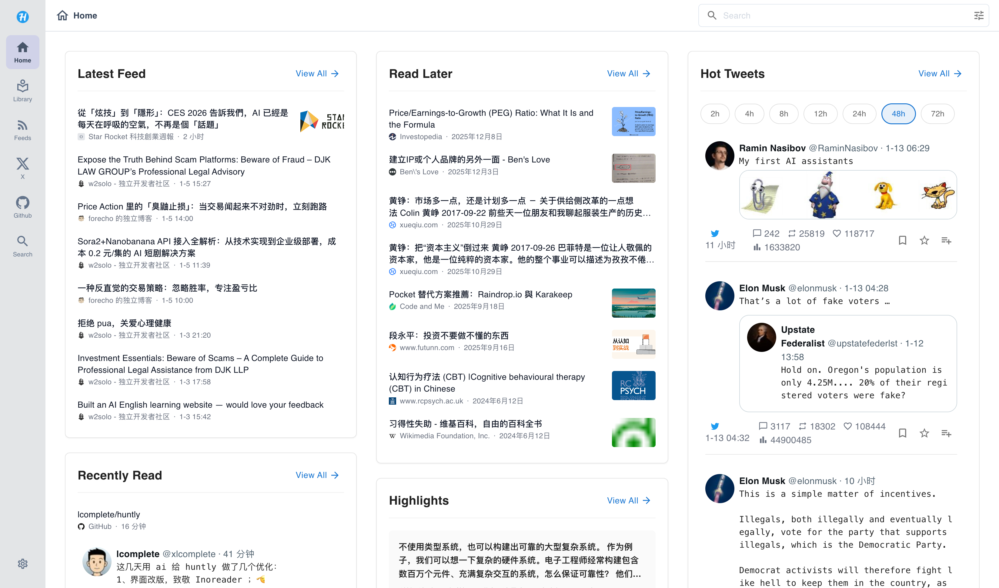
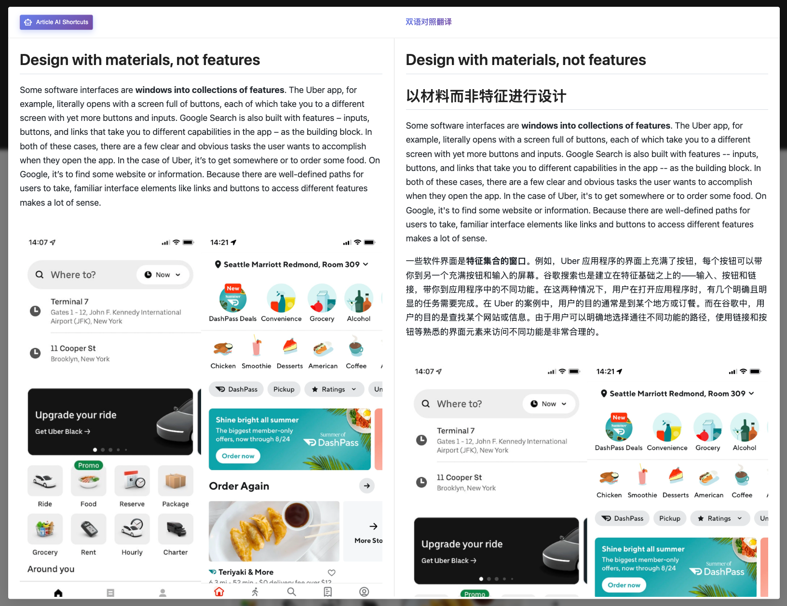

**中文** | [English](./README.md)

<div align="center">

✨ 特别感谢 ✨

<a href="https://www.augmentcode.com/">
  
</a>

**[Augment Code](https://www.augmentcode.com/)** - Better Context. Better Agent. Better Code.

---

<!-- Huntly Logo & Title -->


# Huntly

**您的个人 AI 驱动信息中心**

自托管信息中心，配备强大的浏览器扩展，可使用 AI 捕获、处理和组织网页内容——将您的浏览转化为可操作的知识。

<!-- Badges -->
[](https://github.com/lcomplete/huntly/stargazers)
[](https://github.com/lcomplete/huntly/blob/main/LICENSE)
[](https://hub.docker.com/r/lcomplete/huntly)
[![DeepWiki](https://img.shields.io/badge/DeepWiki-lcomplete%2Fhuntly-blue?style=flat-square&logo=data:image/png;base64,iVBORw0KGgoAAAANSUhEUgAAACAAAAAgCAYAAABzenr0AAAC/klEQVR4nMSXz0tUURTHP+fe9+bNvBnTMRudhIoWtWgRtGoRBK2C/oAg2rUuiGpZy4L+hyC6bdu2TYto4aJFSFAQlRq5yKwZHfPNvPvj3BYzjjo/3ryZFvfAg8c793zP955z7r0PiijvdHd8FMrDVuD8RV5wLI9IPgRO9nS8e1d+wWGok1hOiHhWvkfO7wC72vrOlvMF5EPlr93dN4Z//XE5Dxj5v37AB8B/5r+6OoqCkGrzot4kvjMwQXOitR3V7qdl5AIBkP9I6kEkCvLj6/vO1kuLKhfzoblG+c2t7+33Z4pทDy9zqXOm5MLGHLf0Nff/WBTM7hnOw0HAfmi0I2xPY+EiC49ptvzPfFl79dfuP4j6VZsV9LXDK05Y4E0X3MjapuO6XFB0e5EIQ+GRWK07HuvuLLbp0Z3e+6Q9UXbnDVAT5A3pJYLYBKiT0EthbZJ1nv2ptvNXP9f7V/0kVW6rEq8F4z0NDK2l3fvt+oJPLQ4vGTe6FDypPxhgJuI3GEh4xzzWVFf5WPL2mG7xgpCRG0WaFVXJQnGqhxYU5cD1w/uZHpqVGvqbIQ4IWP/5h5WBBa1v9E2KQ4MhMD29NnNp/OeS1F44F3xz/UjTuIAEXhEHGfnCsS0KxCqXx0a0/MYjPn/SDRkLPpAQ8j8OD8L0+7XwC0Y/SXMEaLGp8nKCsN9tFllZBzgKDoYl3A2opVLOhON4Q0yMRhC0gC8gIIEQxsgnT/BDBVAI8c0PGz/HUe3CMR4IYJzGPL3J5D2DFDqg7TaXQBhYRQRTACHFE1HJLdHXx2WOFbzBhSoJxjERYCxl4E9RguNm7Ef/0M+rPsxc/1vynI4IfS76gVCNORbzR+E1BBEQS8Kg89BoF49OtfD4FFGBERHhJcTl1NB5i8m0fXp3q+7z+PKN8DL/r7OmjE8DYZWKYwYj6r3aNNQMJL6mLlX49p0VFrJ3nLsN4E7ER7G6PKNG04ApWsX+CNa3ftJsj+/ufA/+Q9KJjqMfxJPj1PkZ/B7N4j6QAAAABJRU5ErkJggg==)](https://deepwiki.com/lcomplete/huntly)

🤖 **AI 驱动** · 🔒 **100% 自托管** · 🚀 **多平台支持**

[官网](https://huntly.codelc.com) · [文档](https://huntly.codelc.com/docs) · [下载](https://huntly.codelc.com/download)

</div>

## 功能特性

> [!TIP]
> 项目正在快速开发中，推荐使用 Docker 配合自动更新（如 Watchtower）以保持最新版本。

| 功能 | 描述 |
|---------|-------------|
| 🤖 **AI 内容处理** | 利用 AI 进行摘要、翻译和智能内容分析，支持自定义快捷指令 |
| 🔌 **MCP 服务器集成** | 内置 Model Context Protocol (MCP) 服务器，让 AI 助手（Claude、Cursor 等）可以访问您的知识库、搜索内容、获取 RSS 订阅、推文、GitHub stars 和高亮标注 |
| 📚 **网页归档** | 使用 Mozilla Readability 自动保存和归档网页，提取正文内容 |
| 📡 **RSS 订阅管理** | 集中管理所有 RSS 订阅，支持智能分类、OPML 导入/导出和全文搜索 |
| 🔍 **强大的全文搜索** | Apache Lucene 搜索引擎，IK 分词器支持中文分词，布尔运算符和模糊搜索 |
| 🐦 **社交媒体集成** | 特殊处理 Twitter/X 内容，自动重建推文线程并保存媒体 |
| ⭐ **GitHub 集成** | 同步和组织您的 GitHub stars，提取仓库元数据和 README |
| 🔒 **隐私与自托管** | 100% 自托管，SQLite 数据库，Docker 部署，完全掌控您的数据 |
| 💻 **多平台支持** | Web 应用、Chrome 扩展(Manifest V3)和桌面应用(Tauri) |

## 路线图

- [ ] 将所有保存的内容导出为 Markdown
- [ ] 增强扩展功能，支持独立 AI 处理(无需服务器)
- [ ] 灵活的组织方式：标签、文件夹

## 系统截图






## 快速开始

### 步骤 1：安装浏览器扩展

浏览器扩展是自动保存网页和 Twitter 内容的必备工具。

**Chrome：**
- 从 [Chrome 应用商店](https://chrome.google.com/webstore/detail/huntly/cphlcmmpbdkadofgcedjgfblmiklbokm) 安装

### 步骤 2：运行服务端

选择以下方法之一运行 Huntly 服务端：

#### 方式 A：Docker Compose（推荐）

创建 `docker-compose.yml` 文件：

```yaml
version: '3.8'

services:
  huntly:
    image: lcomplete/huntly
    container_name: huntly
    restart: always
    ports:
      - "8088:80"
    volumes:
      - ~/data/huntly:/data
    labels:
      - "com.centurylinklabs.watchtower.enable=true"
```

建议使用 [Watchtower](https://containrrr.dev/watchtower/) 进行自动更新以获取最新功能。

然后运行：

```sh
docker-compose up -d
```

#### 方式 B：桌面客户端

从 [Releases](https://github.com/lcomplete/huntly/releases) 下载适合您操作系统的安装包，安装后运行即可。

如果在 macOS 上遇到 `"Huntly.app" is damaged and can't be opened` 错误消息，请运行：

```sh
sudo xattr -r -d com.apple.quarantine /YOUR_PATH/Huntly.app
```

查看 [运行服务端 wiki](https://github.com/lcomplete/huntly/wiki/Run-the-Server) 了解更多选项。

### 步骤 3：配置扩展并登录

1. 点击 Huntly 扩展图标并设置服务器地址。对于远程访问，强烈建议使用 HTTPS 以保护隐私。
2. 首次打开 Huntly 网站时注册一个管理员用户
3. 注册后，您将自动登录，扩展将仅发送相关的浏览数据（如保存的页面和推文）到服务器。

**尽情享受吧！**

## 成为赞助者

如果您觉得 Huntly 有帮助，请考虑支持它的开发！

[](https://github.com/sponsors/lcomplete)


<p align="center">
	
	
</p>

### 赞助者

感谢所有赞助者的慷慨支持！

<table>
  <tr>
    <td align="center"><a href="https://www.augmentcode.com/">augment code</a></td>
    <td align="center"><a href="https://www.jetbrains.com/">jetbrains</a></td>
    <td align="center"><a href="https://taresky.com/">TARESKY</a></td>
    <td align="center"><a href="https://x.com/Db9el25LULCBrcn">抹茶</a></td>
  </tr>
</table>